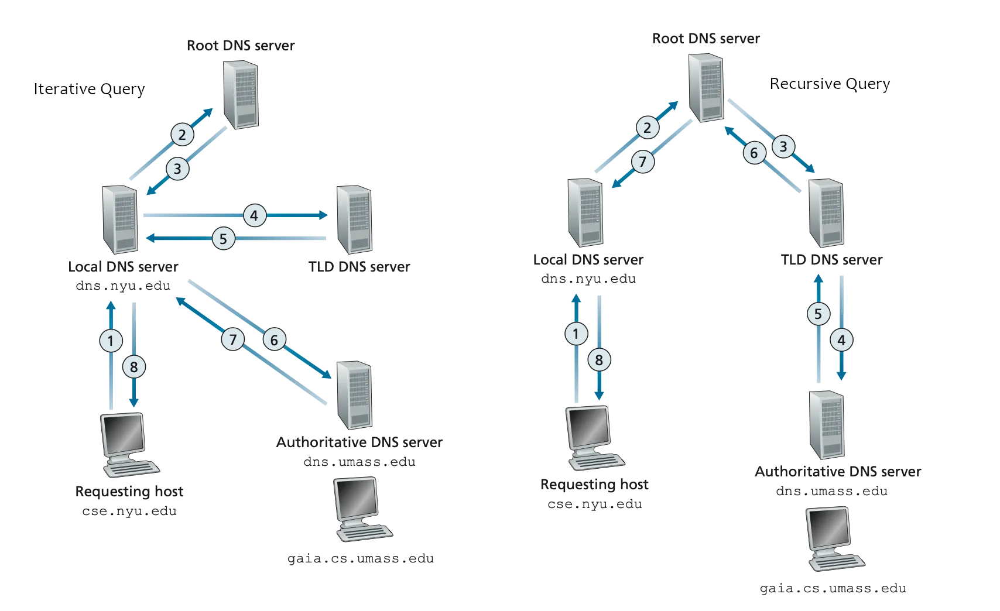

## questions

2.1 Caching-only nameserver configuration

Configure the nameserver to forward all queries for which it does not have a cached answer to Google's public nameserver (8.8.8.8). Only allow queries and recursion from local network.

Start your nameserver and watch the logfile /var/log/syslog for any error messages. Check that you can resolve addresses through your own nameserver from the client machine. You can use dig(1) to do the lookups.

```
# refer to https://www.digitalocean.com/community/tutorials/how-to-configure-bind-as-a-caching-or-forwarding-dns-server-on-ubuntu-14-04

1. install bind9
2. add forwarders, allow-recursion, allow-query, recursion
3. restart bind9


netstat -nap | grep 2882
ss -lntp | grep 2882


# /etc/bind
cp /etc/bind/named.conf.options{,.bak}
vim /etc/bind/named.conf.options
max-cache-ttl 600 # 600s


#  -x option is supplied to indicate a reverse lookup
dig @192.168.1.10 www.alibaba.com

# view bind9 cache https://linuxconfig.org/how-to-view-and-clear-bind-dns-server-s-cache-on-linux
rndc dumpdb -cache
grep alibaba /var/named/data/cache_dump.db  // /var/cache/bind
rndc flush


vagrant@client:~$ dig @192.168.1.10 google.com

; <<>> DiG 9.16.1-Ubuntu <<>> @192.168.1.10 google.com
; (1 server found)
;; global options: +cmd
;; Got answer:
;; ->>HEADER<<- opcode: QUERY, status: NOERROR, id: 56508
;; flags: qr rd ra; QUERY: 1, ANSWER: 1, AUTHORITY: 0, ADDITIONAL: 1

;; OPT PSEUDOSECTION:
; EDNS: version: 0, flags:; udp: 4096
; COOKIE: 6b7994a5f843c9cb0100000063fb7332aa2bdd6e77a285c8 (good)
;; QUESTION SECTION:
;google.com.                    IN      A

;; ANSWER SECTION:
google.com.             300     IN      A       142.250.200.46

;; Query time: 120 msec
;; SERVER: 192.168.1.10#53(192.168.1.10)
;; WHEN: Sun Feb 26 14:56:51 UTC 2023
;; MSG SIZE  rcvd: 83
```

2.2 What is a recursive query? How does it differ from an iterative query?

https://www.omnisecu.com/tcpip/recursive-and-iterative-dns-queries.php
DNS hierarchy: https://www.omnisecu.com/tcpip/dns-namespace-hierarchy.php

In Recursive DNS Query, If the DNS Server doesn't know the answer to provide accurate answer to the DNS Client, DNS Server may query other DNS Servers on behalf of the DNS Client.

In Iterative DNS Query, when a DNS Client asks the DNS server for name resolution, the DNS Server provides the best answer it has. If the DNS Server doesn't know the answer to the DNS Query from Client, the answer can be a reference to another lower level DNS Server also. This lower level DNS Server is delegated at the higher level DNS Server to be Authoritative for the DNS namespace which the DNS Query is related with. Once the DNS Client get the referral from higher level DNS Server, it can then send a DNS Query to the lower level DNS server, got as referral.


The main difference between the two approaches is that in a recursive query, the
responsibility of finding the complete answer is taken on by the DNS resolver,
while in an iterative query, the responsibility is shared between the client and
the DNS servers. The use of recursive queries is more common in modern DNS
setups, as it simplifies the process for the client and reduces the load on
individual DNS servers.



3.1 Configure ns1 to be the primary master for .insec domain.

	
Explain your configuration.
```
# refer to https://blog.csdn.net/networken/article/details/120908256

1. add zone definition in named.conf
2. add zone file
3. restart bind9

# check configuration if there is any error
named-checkconf
named-checkzone insec ./db.1.168.192.in-addr.arpa
named-checkzone insec ./db.insec
```

3.2 Provide the output of dig(1) for a successful query.

```
vagrant@client:~$ dig @192.168.1.10 ns1.insec

; <<>> DiG 9.16.1-Ubuntu <<>> @192.168.1.10 ns1.insec
; (1 server found)
;; global options: +cmd
;; Got answer:
;; ->>HEADER<<- opcode: QUERY, status: NOERROR, id: 32798
;; flags: qr aa rd ra; QUERY: 1, ANSWER: 1, AUTHORITY: 0, ADDITIONAL: 1

;; OPT PSEUDOSECTION:
; EDNS: version: 0, flags:; udp: 4096
; COOKIE: 28aba889496891ee0100000063fb56f4cc676d580478b335 (good)
;; QUESTION SECTION:
;ns1.insec.                     IN      A

;; ANSWER SECTION:
ns1.insec.              60      IN      A       192.168.1.10

;; Query time: 0 msec
;; SERVER: 192.168.1.10#53(192.168.1.10)
;; WHEN: Sun Feb 26 12:56:21 UTC 2023
;; MSG SIZE  rcvd: 82

```

3.3 How would you add an IPv6 address entry to a zone file?

To add an IPv6 address entry to a zone file, you can use an AAAA record, which is used to map a hostname to an IPv6 address. Here is an example of how you would add an AAAA record to a zone file:

`host1.insec. IN AAAA 2001:0db8:85a3:0000:0000:8a2e:0370:7334`

host1.insec. is the hostname for which the IPv6 address is being defined.
IN is the record class, which stands for "Internet." AAAA is the record type, which stands for "IPv6 address." 2001:0db8:85a3:0000:0000:8a2e:0370:7334 is the IPv6 address being mapped to the hostname. After adding the AAAA record to your zone file, be sure to save the changes and reload your DNS server to make the changes take effect.


4.1 Configure ns2 to work as a slave for .insec domain.

	
Demonstrate the successful zone file transfer.
```
# show zone file in slave
1. cd /var/cache/bind in slave node ns2
2. named-compilezone -f raw -F text -o insec.zone.out insec db.insec
3. cat insec.zone.out

# show serial number
dig ns1.insec SOA @192.168.1.10
dig ns1.insec SOA @192.168.1.11

# show logs


```

4.2 Explain the changes you made
```
1. add zone definition in named.conf in slave node ns2.
2. on the master server n1, add an entry (A, PTR and NS -records) for the slave server ns2.
3. increase the serial number for the zone on the master server n1.
3. rndc reload insec on the master server n1.


// check the configuration
named-checkzone insec ./db.1.168.192.in-addr.arpa
named-checkzone insec ./db.insec

// reboot the master/slave to reload the latest configuration
// root@lab3:/etc/bind# systemctl restart bind9

// reload configuration
rndc reload insec
```

4.3 Provide the output of dig(1) for a successful query from the slave server.
Are there any differences to the queries from the master?

```
root@lab2:/var/cache/bind# dig @192.168.1.11 ns1.insec

; <<>> DiG 9.16.1-Ubuntu <<>> @192.168.1.11 ns1.insec
; (1 server found)
;; global options: +cmd
;; Got answer:
;; ->>HEADER<<- opcode: QUERY, status: NOERROR, id: 29484
;; flags: qr aa rd ra; QUERY: 1, ANSWER: 1, AUTHORITY: 0, ADDITIONAL: 1

;; OPT PSEUDOSECTION:
; EDNS: version: 0, flags:; udp: 4096
; COOKIE: 9baf5460adde9d9a0100000063fa71b0bad3d90bf0900165 (good)
;; QUESTION SECTION:
;ns1.insec.                     IN      A

;; ANSWER SECTION:
ns1.insec.              60      IN      A       192.168.1.10

;; Query time: 0 msec
;; SERVER: 192.168.1.11#53(192.168.1.11)
;; WHEN: Sat Feb 25 20:38:08 UTC 2023
;; MSG SIZE  rcvd: 82

```

In DNS, a slave server (also known as a secondary server) obtains DNS information from a master (or primary) server through a process called zone transfer. The slave server uses this information to answer queries for a specific portion of the DNS namespace, called a zone.

There should be no difference in the query process between a master and a slave server, as both servers are capable of answering queries. However, the data served by the slave server is a copy of the data on the master server and may be slightly out of date, as zone transfers are not performed in real-time. Additionally, the master server is responsible for making changes to the DNS data, while the slave server is read-only.


5.1 Create a subdomain .not.insec, use ns2 as a master and ns3 as a slave.

	
Explain the changes you made.
```
# lab2
1. add zone definition in named.conf on ns2
2. add zone file db.not.insec on ns2

# lab3
1. add zone definition in named.conf on ns3


# lab1
1. add forward zone in named.conf
2. add 'glue' record in db.insec
```

5.2 Provide the output of dig(1) for successful queries from all the three name
servers.

```
root@lab1:/etc/bind# dig @192.168.1.10 ns2.not.insec

; <<>> DiG 9.16.1-Ubuntu <<>> @192.168.1.10 ns2.not.insec
; (1 server found)
;; global options: +cmd
;; Got answer:
;; ->>HEADER<<- opcode: QUERY, status: NOERROR, id: 55600
;; flags: qr rd ra; QUERY: 1, ANSWER: 1, AUTHORITY: 0, ADDITIONAL: 1

;; OPT PSEUDOSECTION:
; EDNS: version: 0, flags:; udp: 4096
; COOKIE: 3d2bbf7c042d4cb60100000063fa71eb6d485ab449f4a909 (good)
;; QUESTION SECTION:
;ns2.not.insec.                 IN      A

;; ANSWER SECTION:
ns2.not.insec.          41      IN      A       192.168.1.11

;; Query time: 0 msec
;; SERVER: 192.168.1.10#53(192.168.1.10)
;; WHEN: Sat Feb 25 20:39:07 UTC 2023
;; MSG SIZE  rcvd: 86


root@lab2:/var/cache/bind# dig @192.168.1.11 ns2.not.insec

; <<>> DiG 9.16.1-Ubuntu <<>> @192.168.1.11 ns2.not.insec
; (1 server found)
;; global options: +cmd
;; Got answer:
;; ->>HEADER<<- opcode: QUERY, status: NOERROR, id: 27381
;; flags: qr aa rd ra; QUERY: 1, ANSWER: 1, AUTHORITY: 0, ADDITIONAL: 1

;; OPT PSEUDOSECTION:
; EDNS: version: 0, flags:; udp: 4096
; COOKIE: 8902a731681adbd70100000063fa720d709fa05ab105c770 (good)
;; QUESTION SECTION:
;ns2.not.insec.                 IN      A

;; ANSWER SECTION:
ns2.not.insec.          60      IN      A       192.168.1.11

;; Query time: 0 msec
;; SERVER: 192.168.1.11#53(192.168.1.11)
;; WHEN: Sat Feb 25 20:39:41 UTC 2023
;; MSG SIZE  rcvd: 86

root@lab3:/var/cache/bind# dig @192.168.1.12 ns2.not.insec

; <<>> DiG 9.16.1-Ubuntu <<>> @192.168.1.12 ns2.not.insec
; (1 server found)
;; global options: +cmd
;; Got answer:
;; ->>HEADER<<- opcode: QUERY, status: NOERROR, id: 47260
;; flags: qr aa rd ra; QUERY: 1, ANSWER: 1, AUTHORITY: 0, ADDITIONAL: 1

;; OPT PSEUDOSECTION:
; EDNS: version: 0, flags:; udp: 4096
; COOKIE: b52ea84027bcce040100000063fb577eb4bcf5f7d7deff0a (good)
;; QUESTION SECTION:
;ns2.not.insec.                 IN      A

;; ANSWER SECTION:
ns2.not.insec.          60      IN      A       192.168.1.11

;; Query time: 0 msec
;; SERVER: 192.168.1.12#53(192.168.1.12)
;; WHEN: Sun Feb 26 12:58:38 UTC 2023
;; MSG SIZE  rcvd: 86
```

6.1 Implement transaction signatures

Explain the changes you made. Show the successful and the unsuccessful zone transfer in the log.
```
refer to https://tomthorp.me/blog/using-tsig-enable-secure-zone-transfers-between-bind-9x-servers

1. generate key on lab2
root@lab2:/etc/bind# tsig-keygen -a hmac-sha1 keyname | tee keyname.key
key "keyname" {
        algorithm hmac-sha1;
        secret "w5aj7j4O54Tl6OdncPOMr0aKnno=";
};
root@lab2:/etc/bind# cat keyname.key
key "keyname" {
        algorithm hmac-sha1;
        secret "w5aj7j4O54Tl6OdncPOMr0aKnno=";
};
2. add key to named.conf on lab2
3. change zone definition on lab2 allow-transfer { key "keyname";};
4. copy key to lab3
5. add key to named.conf on lab3
6. add server definition on lab3
server 192.168.1.11 {
  keys {keyname;};
};

# show log
root@lab2:~# tail -f /var/log/syslog
Feb 26 12:48:30 ubuntu-focal named[3350]: transfer of 'insec/IN' from 192.168.1.10#53: Transfer completed: 1 messages, 10 records, 252 bytes, 0.004 secs (63000 bytes/sec)
Feb 26 12:48:30 ubuntu-focal named[3350]: zone insec/IN: sending notifies (serial 2022120100)
Feb 26 12:48:34 ubuntu-focal systemd[1]: systemd-timedated.service: Succeeded.
Feb 26 12:48:37 ubuntu-focal systemd[1]: systemd-hostnamed.service: Succeeded.
Feb 26 12:48:39 ubuntu-focal named[3350]: resolver priming query complete
Feb 26 12:48:39 ubuntu-focal named[3350]: managed-keys-zone: Unable to fetch DNSKEY set '.': timed out
Feb 26 12:49:37 ubuntu-focal systemd[1]: Started Session 4 of user vagrant.
Feb 26 12:49:40 ubuntu-focal named[3350]: client @0x7f72d402df50 192.168.1.12#56615/key keyname (not.insec): transfer of 'not.insec/IN': AXFR started: TSIG keyname (serial 2022120200)
Feb 26 12:49:40 ubuntu-focal named[3350]: client @0x7f72d402df50 192.168.1.12#56615/key keyname (not.insec): transfer of 'not.insec/IN': AXFR ended: 1 messages, 6 records, 261 bytes, 0.001 secs (261000 bytes/sec)
Feb 26 12:50:46 ubuntu-focal systemd[1]: session-3.scope: Succeeded.

root@lab3:/var/cache/bind# grep 'named' /var/log/syslog 
Feb 26 12:49:40 ubuntu-focal named[3361]: zone not.insec/IN: Transfer started.
Feb 26 12:49:40 ubuntu-focal named[3361]: transfer of 'not.insec/IN' from 192.168.1.11#53: connected using 192.168.1.12#56615 TSIG keyname
Feb 26 12:49:40 ubuntu-focal named[3361]: zone not.insec/IN: transferred serial 2022120200: TSIG 'keyname'
Feb 26 12:49:40 ubuntu-focal named[3361]: transfer of 'not.insec/IN' from 192.168.1.11#53: Transfer status: success
Feb 26 12:49:40 ubuntu-focal named[3361]: transfer of 'not.insec/IN' from 192.168.1.11#53: Transfer completed: 1 messages, 6 records, 261 bytes, 0.003 secs (87000 bytes/sec)

# test unauthenticated and unauthenticated zone transfer
root@lab3:/etc/bind# dig @192.168.1.11 not.insec axfr

; <<>> DiG 9.16.1-Ubuntu <<>> @192.168.1.11 not.insec axfr
; (1 server found)
;; global options: +cmd
; Transfer failed.


root@lab3:/etc/bind# dig @192.168.1.11 not.insec axfr -k /etc/bind/keyname.key

; <<>> DiG 9.16.1-Ubuntu <<>> @192.168.1.11 not.insec axfr -k /etc/bind/keyname.key
; (1 server found)
;; global options: +cmd
not.insec.              60      IN      SOA     ns2.not.insec. not.hostmaster.insec. 2022120203 60 60 60 60
not.insec.              60      IN      NS      ns2.not.insec.
host1.not.insec.        60      IN      A       192.168.2.99
ns2.not.insec.          60      IN      A       192.168.1.11
ns3.not.insec.          60      IN      A       192.168.2.11
not.insec.              60      IN      SOA     ns2.not.insec. not.hostmaster.insec. 2022120203 60 60 60 60
keyname.                0       ANY     TSIG    hmac-sha1. 1677358981 300 20 /4I5B/aG097YwojLf5air9NN3ko= 57184 NOERROR 0
;; Query time: 4 msec
;; SERVER: 192.168.1.11#53(192.168.1.11)
;; WHEN: Sat Feb 25 21:03:01 UTC 2023
;; XFR size: 6 records (messages 1, bytes 300)

```

6.2 TSIG is one way to implement transaction signatures. DNSSEC describes
another, SIG(0). Explain the differences.

TSIG (Transaction SIGnature) and SIG(0) (Signature 0) are both methods for authenticating DNS transactions, but they are different in their implementation and security properties.

TSIG uses a secret key shared between the client and server to sign each DNS transaction and ensure its integrity and authenticity. TSIG uses a message-digest algorithm (such as hmac-sha1) to generate the signature.

SIG(0) (Signature 0), on the other hand, is part of the DNSSEC (Domain Name System Security Extensions) protocol, which provides a more comprehensive security mechanism for the DNS. DNSSEC uses public-key cryptography to secure the DNS data, and SIG(0) is used to sign individual resource records within a DNS zone. Unlike TSIG, which only provides transaction-level security, DNSSEC provides end-to-end security for the entire DNS data, from the root zone down to individual resource records.

In summary, while both TSIG and SIG(0) are methods for authenticating DNS transactions, TSIG provides transaction-level security while SIG(0) provides end-to-end security for the entire DNS data through the use of public-key cryptography.

7.1 Based on the dig-queries, how does Pi-hole block domains on a DNS level?
the first option    client -> pihole -> bind9
```
# refer to https://www.techaddressed.com/tutorials/basic-pi-hole-config/
systemctl stop bind9 # stop bind9；因为bind9会监听53端口，所以pihole无法监听53端口
# 设置upstream DNS为google的DNS 8.8.8.8
curl -sSL https://install.pi-hole.net | bash 
pihole -a -p # set password 123456
pihole restartdns

systemctl status pihole-FTL.service # 查看pihole的运行状态

# set web interface
systemctl restart lighttpd
vim /etc/lighttpd/lighttpd.conf # 可以调整http运行的端口

ssh -NL 8081:localhost:80 vagrant@127.0.0.1 -p 2222

# http://localhost:8081/admin/   # 打开web界面进行配置
# Clients 添加 可以允许访问client的IP地址


https://docstore.mik.ua/orelly/networking_2ndEd/dns/ch10_15.htm
pihole-FTL port: https://docs.pi-hole.net/main/prerequisites/
FTL means: "Faster than Light"

vim /etc/bind/named.conf.options // 将bind9的端口设置为5353 listen-on port 5353 { 127.0.0.1; 192.168.1.10;};
# 将pihole设置为upstream DNS设置为bind9
```
the second option (adapted this option) client -> bind9 -> pihole
```
1. set pi-hole upstream DNS to 8.8.8.8
1. set pi-hole port to 5353
2. set forwarder to 127.0.0.1#5353 in bind9
```

the logs of adding blacklist
```
# Domains add google.com to blacklist
root@lab1:/etc/bind# dig @192.168.1.10 google.com

; <<>> DiG 9.16.1-Ubuntu <<>> @192.168.1.10 google.com
; (1 server found)
;; global options: +cmd
;; Got answer:
;; ->>HEADER<<- opcode: QUERY, status: NOERROR, id: 8767
;; flags: qr aa rd ra; QUERY: 1, ANSWER: 1, AUTHORITY: 0, ADDITIONAL: 1

;; OPT PSEUDOSECTION:
; EDNS: version: 0, flags:; udp: 4096
;; QUESTION SECTION:
;google.com.                    IN      A

;; ANSWER SECTION:
google.com.             2       IN      A       0.0.0.0

;; Query time: 4 msec
;; SERVER: 192.168.1.10#53(192.168.1.10)
;; WHEN: Sat Feb 25 21:58:32 UTC 2023
;; MSG SIZE  rcvd: 55


# remove blacklist
root@lab1:/etc/bind# dig @192.168.1.10 google.com

; <<>> DiG 9.16.1-Ubuntu <<>> @192.168.1.10 google.com
; (1 server found)
;; global options: +cmd
;; Got answer:
;; ->>HEADER<<- opcode: QUERY, status: NOERROR, id: 24367
;; flags: qr rd ra; QUERY: 1, ANSWER: 1, AUTHORITY: 0, ADDITIONAL: 1

;; OPT PSEUDOSECTION:
; EDNS: version: 0, flags:; udp: 512
;; QUESTION SECTION:
;google.com.                    IN      A

;; ANSWER SECTION:
google.com.             48      IN      A       142.250.74.142

;; Query time: 24 msec
;; SERVER: 192.168.1.10#53(192.168.1.10)
;; WHEN: Sat Feb 25 21:58:52 UTC 2023
;; MSG SIZE  rcvd: 55
```

The difference of Pi-hole and bind9:
https://www.reddit.com/r/homelab/comments/ln8esx/bind_vs_pihole/

Pi-hole block mode: https://docs.pi-hole.net/ftldns/blockingmode/

In NULL mode, which is both the default and recommended mode for Pi-hole FTLDNS, blocked queries will be answered with the "unspecified address" (0.0.0.0).

Pi-hole works by intercepting DNS queries and blocking them if the domain name matches one of the entries in its block list. It does this by operating as a DNS server, and when a client makes a DNS query, Pi-hole will process the query and check if the domain name being requested is on the block list. If it is, Pi-hole will return a fake, non-existent IP address, effectively blocking the connection to that domain. The block list can be customized, so you can add or remove entries as needed.


7.2 How could you use Pi-hole in combination with your own DNS server, such as your caching-only nameserver?

Configuring DNS server to forward all DNS queries to Pi-hole. This way,  DNS server will act as a caching-only nameserver, storing the responses from Pi-hole in its cache for a certain amount of time to reduce the number of queries it needs to make.

Install Pi-hole on a separate server or change the listening port on the same machine. Configure your caching-only nameserver to forward all DNS queries to Pi-hole. This can typically be done by adding a forwarder to your DNS configuration file, such as named.conf. On your clients, configure the DNS server to use the IP address of your caching-only nameserver. 

With this setup, the caching-only nameserver will receive all DNS queries from clients, cache the responses from Pi-hole, and return the cached responses to clients for future queries. This will help reduce the number of queries that need to be made to Pi-hole, making the system more efficient.

In addition, Pi-hole will still be able to block unwanted domains, as it will receive all the DNS queries from your caching-only nameserver and return the appropriate response. This means that you will be able to take advantage of the domain blocking functionality provided by Pi-hole, as well as the caching capabilities provided by your own DNS server.


## Basic DNS concepts

```
https://www.starduster.me/2016/08/16/brief-discussion-of-dns-lookup/
```

Caching DNS Server: When a caching DNS server tracks down the answer to a
client’s query, it returns the answer to the client. But it also stores the
answer in its cache for the period of time allowed by the records’ TTL value.

Forwarding DNS Server: A forwarding DNS server offers the same advantage of
maintaining a cache to improve DNS resolution times for clients. However, it
actually does none of the recursive querying itself. Instead, it forwards all
requests to an outside resolving server and then caches the results to use for
later queries.

bind9 configuration file

- named.conf
- named.conf.options
- named.conf.local
- named.conf.default-zones

bind9 concepts

- acl
  定义这部分的内容来规定IP是否能够被接入以及Blocklist来阻止某些特定的IP地址介入到域名解析服务器中。
- zone file 定义域名与IP地址的映射关系以及DNS发送的解析域名数据包的相关参数设置
  @代表当前的区域，可以由@ORIGIN定义

Transaction Signatures (TSIG) provide a secure method for communicating from a
primary to a secondary Domain Name server (DNS).

```
# blogs
https://blog.csdn.net/wangye1989_0226/article/details/72773290

https://blog.51cto.com/aolens/1536630

https://www.zytrax.com/books/dns/ch9/delegate.html

https://www.cnblogs.com/doherasyang/p/14464999.html
```
